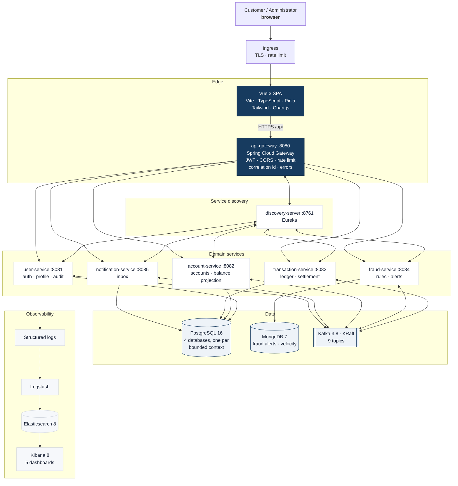
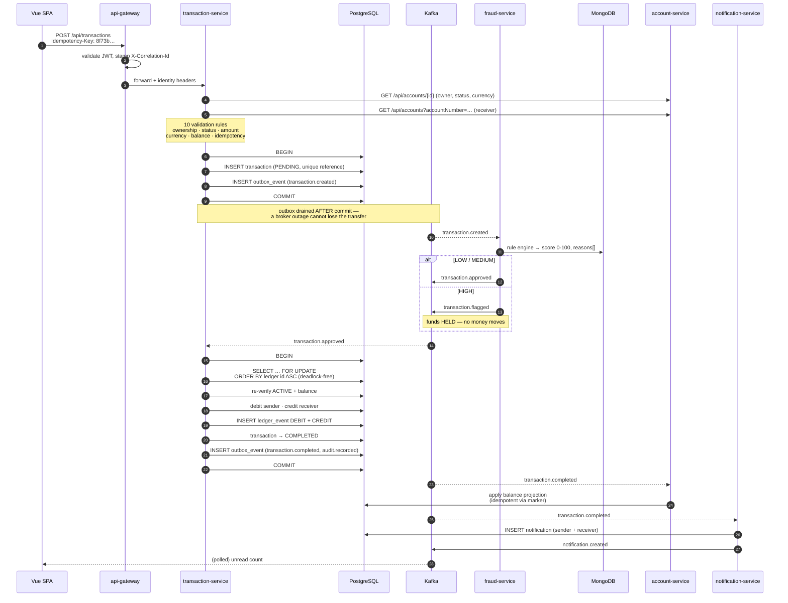

# Finova

**Digital Banking & Smart Transaction Platform**

> Banking made simple. Transactions made smarter.

A portfolio-grade event-driven banking platform: eight Spring Boot services behind a
reactive API gateway, a rule-based fraud engine, Kafka-driven settlement, and a Vue 3
client that behaves like a real FinTech product.

Everything here runs locally with one command, is fully tested, and is honest about
what it does and does not do.

---

## Table of contents

- [What it does](#what-it-does)
- [Architecture](#architecture)
- [The transfer flow](#the-transfer-flow-end-to-end)
- [Technology](#technology)
- [Quick start](#quick-start)
- [Demo accounts](#demo-accounts)
- [Services and ports](#services-and-ports)
- [Repository layout](#repository-layout)
- [API documentation](#api-documentation)
- [Testing](#testing)
- [Observability](#observability)
- [Kubernetes](#kubernetes)
- [Design decisions](#design-decisions-worth-reading)
- [Known gaps](#known-gaps)
- [Future improvements](#future-improvements)

---

## What it does

**Customers**

- Register, sign in with JWT, refresh the session silently, sign out
- Manage a profile, read a security centre, tune notification preferences
- Open checking and savings accounts in TND / EUR / USD
- See balances, a reconstructed balance history, and a full transaction ledger
- Send money through a four-step flow with recipient verification, an idempotency key
  and a review screen — then follow the exact lifecycle of that transfer
- Receive event-driven notifications for completed, failed and held transfers
- Be blocked, and see why

**Administrators**

- Platform overview: users, active accounts, today's transactions, volume, open alerts
- Users, accounts and transaction tables with real filtering and pagination
- A fraud operations console: risk distribution, alerts ranked by score, per-alert
  timelines and review history
- Review actions — start review, mark safe (releases held funds), confirm fraud,
  block an account — each one confirmed and audited
- An immutable audit log filterable by action, actor, result and time

**The platform itself**

- Nine Kafka topics, each with exactly one producer and one meaning
- A rule-based fraud engine scoring 0–100 across five weighted rules
- Pessimistic locking with a global lock ordering that makes deadlock impossible
- An outbox pattern on every event publication, so a broker outage cannot lose money
- Structured logs correlated end-to-end into Elasticsearch and visualised in Kibana

---

## Architecture

### System context



### A single transfer, end to end

The most important thing in this project is that the money path is genuinely
correct. It is not "update two rows and hope".



### Domain events

Each topic has exactly one producer and one meaning. Approval is deliberately
separate from completion — otherwise a consumer cannot tell whether to settle
or to notify, and a redelivered message could announce a payment that never moved.

| Topic | Producer | Consumers |
|---|---|---|
| `transaction.created` | transaction-service | fraud-service |
| `transaction.approved` | fraud-service | transaction-service |
| `transaction.flagged` | fraud-service | transaction-service, notification-service |
| `transaction.completed` | transaction-service | account-service, notification-service |
| `transaction.failed` | transaction-service | notification-service |
| `account.opened` | account-service | transaction-service |
| `account.blocked` | account-service, fraud-service | notification-service |
| `notification.created` | notification-service | activity feed |
| `audit.recorded` | every service | user-service |

Full detail: [`backend/EVENT-FLOW.md`](backend/EVENT-FLOW.md).

### Fraud scoring

Pure, framework-free, individually unit-tested rules.

| Rule | Weight | Fires when |
|---|---|---|
| `LARGE_AMOUNT` | 55 | amount above the currency threshold (TND 10,000) |
| `BURST_VELOCITY` | 30 / 45 | more than 5 transfers from the account in 60s (6–10 → 30, >10 → 45) |
| `UNUSUAL_PATTERN` | 25 | amount > 3× the sender's recent average, or > 2× their largest, or a first transfer, or 00:00–05:00 local |
| `NEW_ACCOUNT_RECIPIENT` | 10 | the sender has never paid this beneficiary in 7 days |
| `ROUND_AMOUNT_PROBE` | 10 | a round amount parked *below* the threshold while another rule also fired (a structuring signal) |
| corroboration bonus | +8 each | per additional independent rule that agrees |

Score is clamped to 0–100. Bands: `0–30 LOW`, `31–70 MEDIUM`, `71–100 HIGH`.

The specification's worked example holds exactly: **15,000 TND** with an unusual
pattern scores **88/100 → HIGH**, and there is a test named for it.

---

## Technology

| Layer | Choice |
|---|---|
| Language | Java 17 |
| Framework | Spring Boot 3.3.5 |
| Service discovery | Spring Cloud Netflix Eureka 2023.0.3 |
| Gateway | Spring Cloud Gateway (WebFlux) |
| Inter-service calls | Spring Cloud OpenFeign + LoadBalancer |
| Security | Spring Security 6, JJWT 0.12.6, BCrypt |
| Persistence | Spring Data JPA, Flyway, PostgreSQL 16, Spring Data MongoDB, MongoDB 7 |
| Messaging | Apache Kafka 3.8 (KRaft) via spring-kafka |
| Mapping | MapStruct 1.6.2, Lombok |
| API docs | springdoc-openapi 2.6.0 (Swagger UI + aggregated gateway document) |
| Observability | Actuator, Micrometer, structured logs → Logstash → Elasticsearch → Kibana 8 |
| Frontend | Vue 3.5, TypeScript, Vite 5, Vue Router 4, Pinia 2, Axios, Tailwind 3, lucide-vue-next, Chart.js 4 |
| Tests | JUnit 5, Mockito, Spring Boot Test, Testcontainers, spring-kafka-test |
| Packaging | Docker multi-stage, Docker Compose, Kubernetes |

---

## Quick start

### Prerequisites

Docker Desktop (or Docker Engine 24+ with Compose v2). Nothing else — the JVM,
Maven and Node builds all happen inside the images.

### Run the whole platform

```bash
git clone https://github.com/<your-username>/finova.git
cd finova

cp .env.example .env        # optional: every value has a working default
docker compose up --build
```

The first build compiles eight Spring Boot services and the SPA, so expect
10–20 minutes on a cold cache. Then open:

| | |
|---|---|
| **Application** | http://localhost:5173 |
| **API Gateway** | http://localhost:8080 |
| **Aggregated Swagger UI** | http://localhost:8080/swagger-ui.html |
| **Eureka dashboard** | http://localhost:8761 |
| **Kibana** | http://localhost:5601 |

Import the Kibana dashboards once Kibana is up:

```bash
curl -X POST "http://localhost:5601/api/saved_objects/_import?overwrite=true" \
  -H "kbn-xsrf: true" \
  --form file=@infrastructure/elk/kibana/finova-dashboard.ndjson
```

### Run only the frontend, in mock mode

The SPA ships with a complete mock API, so the whole product is explorable with
no backend at all. This is the fastest way to see the UI.

```bash
cd frontend
npm install
npm run dev
```

Mock mode is a single env switch (`VITE_USE_MOCKS=true` in `frontend/.env`);
`src/mock/*` is cleanly separated from `src/api/*` and can be deleted without
touching a single view.

### Run the backend without Docker

```bash
cd backend
mvn clean install

docker compose up -d postgres mongodb kafka
docker compose run --rm kafka-init

java -jar discovery-server/target/discovery-server.jar
java -jar user-service/target/user-service.jar
java -jar account-service/target/account-service.jar
java -jar transaction-service/target/transaction-service.jar
java -jar fraud-service/target/fraud-service.jar
java -jar notification-service/target/notification-service.jar
java -jar api-gateway/target/api-gateway.jar
```

---

## Demo accounts

Seeded automatically when the services start with the `dev` profile.

| Email | Password | Role |
|---|---|---|
| `takwa@finova.dev` | `Finova#2026` | Customer — 12,450.750 TND everyday + 5,800.000 TND savings |
| `ines.bouzid@finova.dev` | `Finova#2026` | Customer |
| `yassine.trabelsi@finova.dev` | `Finova#2026` | Customer — TND + EUR accounts |
| `salma.gharbi@finova.dev` | `Finova#2026` | Customer |
| `sami.mejboud@finova.dev` | `Finova#2026` | Customer — blocked, for testing the blocked path |
| `admin@finova.dev` | `Finova#2026` | Administrator |

Any real Finova account number works as a transfer recipient — `TN58 2000 0789 1234
5678 90` (Yassine) is a convenient one. A transfer above 10,000 TND is held for
fraud review, which is the fastest way to see the flag path end to end.

> Simulated platform. No real funds are ever moved, no real credentials are used,
> and every identity is fictional.

---

## Services and ports

| Service | Port | Database | Responsibility |
|---|---|---|---|
| `frontend` | 5173 | — | Vue 3 SPA (nginx in Docker) |
| `api-gateway` | 8080 | — | Routing, JWT validation, CORS, rate limiting, correlation ids, errors |
| `discovery-server` | 8761 | — | Eureka registry |
| `user-service` | 8081 | `finova_users` | Registration, login, JWT, profile, refresh tokens, audit system of record |
| `account-service` | 8082 | `finova_accounts` | Accounts, IBANs, statuses, balance read projection |
| `transaction-service` | 8083 | `finova_transactions` | Authoritative ledger, idempotency, settlement, references |
| `fraud-service` | 8084 | MongoDB `finova_fraud` | Rule engine, risk scoring, alerts, review actions |
| `notification-service` | 8085 | `finova_notifications` | Event-driven inbox and preferences |
| `postgres` | 5432 | 4 databases | Bounded context per database |
| `mongodb` | 27017 | `finova_fraud` | Fraud alerts, velocity windows |
| `kafka` | 9092 | — | 9 topics, auto-creation disabled |
| `elasticsearch` | 9200 | — | Log store |
| `logstash` | 5000 | — | Log pipeline |
| `kibana` | 5601 | — | Dashboards |

---

## Repository layout

```
finova/
├── backend/
│   ├── pom.xml                 parent: dependency + plugin management
│   ├── CONVENTIONS.md          the engineering contract every service follows
│   ├── EVENT-FLOW.md           event topology, settlement, idempotency, gaps
│   ├── finova-common/          shared contracts: errors, JWT, domain events
│   ├── discovery-server/
│   ├── api-gateway/
│   ├── user-service/
│   ├── account-service/
│   ├── transaction-service/
│   ├── fraud-service/
│   └── notification-service/
├── frontend/
│   ├── src/
│   │   ├── api/                resource modules + axios interceptors
│   │   ├── mock/               realistic fixtures, removable wholesale
│   │   ├── stores/             Pinia: auth, account, transaction, notification,
│   │   │                       fraud, admin, toast
│   │   ├── components/         ui/ domain/ layout/ charts/
│   │   ├── layouts/            AppShell, AuthLayout
│   │   ├── views/              auth, customer, transfer, admin
│   │   ├── types/              the backend contract, in TypeScript
│   │   └── utils/              money, date, validation, error normalisation
│   └── VIEW-CONTRACT.md        the design contract every view follows
├── infrastructure/
│   ├── docker/                 Dockerfiles, nginx, database bootstrap
│   ├── kafka/                  KRaft config + explicit topic provisioning
│   ├── elk/                    Logstash pipeline + Kibana saved objects
│   └── kubernetes/             namespace, config, secrets, deploys, ingress
├── docs/
│   ├── architecture/
│   ├── api/
│   ├── diagrams/
│   └── screenshots/
├── docker-compose.yml
└── README.md
```

---

## API documentation

| What | Where |
|---|---|
| Aggregated (all services) | http://localhost:8080/swagger-ui.html |
| Machine-readable index | http://localhost:8080/v3/api-docs |
| Route table | http://localhost:8080/v3/api-docs/routes |
| User service | http://localhost:8080/docs/user-service/swagger-ui |
| Account service | http://localhost:8080/docs/account-service/swagger-ui |
| Transaction service | http://localhost:8080/docs/transaction-service/swagger-ui |
| Fraud service | http://localhost:8080/docs/fraud-service/swagger-ui |
| Notification service | http://localhost:8080/docs/notification-service/swagger-ui |

Every service documents its endpoints, schemas, errors and examples, and Swagger
UI has a working **Authorize** button that accepts the access token from
`POST /api/auth/login`.

### Error contract

Every service returns the same envelope, and never a stack trace:

```json
{
  "timestamp": "2026-10-01T14:32:11.482Z",
  "status": 422,
  "code": "INSUFFICIENT_BALANCE",
  "message": "Insufficient balance for this transfer.",
  "path": "/api/transactions",
  "correlationId": "3f1c9a2b-7e4d-4a91-b0c3-5d2e8f14a6b0",
  "details": { "field": "message" }
}
```

`correlationId` is the thread between the browser, the gateway, the ledger and
the log index — it appears in Kibana and in the admin audit log.

---

## Testing

```bash
# Everything
cd backend && mvn clean test

# One module
mvn -pl transaction-service test

# Skip integration tests for a fast feedback loop
mvn test -Dtest='!*IntegrationTest,!*RepositoryTest,!*DeadlockTest'

# Coverage
mvn test jacoco:report      # report at backend/*/target/site/jacoco
```

Frontend:

```bash
cd frontend
npm run typecheck     # vue-tsc --noEmit, strict
npm run build         # typecheck + production bundle
```

Coverage by area:

| Area | Tests |
|---|---|
| Gateway: JWT, CORS, rate limiting, correlation ids, error rendering, routing | 62 |
| Fraud: rule engine, per-rule classes, scoring, velocity atomics, controller authorisation, Mongo repositories | 77 |
| Account: ownership, limits, IBAN mod-97, projection idempotency, status transitions, repositories | 65 |
| Transaction: 10 validation rules, idempotency, settlement, references, fingerprints, concurrency | 115 |
| User | see report |
| Notification | see report |

Testcontainers tests are annotated `@Testcontainers(disabledWithoutDocker = true)`,
so the suite passes on a machine without Docker and runs fully on one with it.
They need a Docker daemon that Testcontainers can negotiate with; on Docker
Desktop 29.x set `DOCKER_API_VERSION` or upgrade Testcontainers.

---

## Observability

Every service emits structured logs carrying `service`, `correlationId`,
`httpMethod`, `requestPath`, `responseStatus`, `durationMs` and `userId`. Logstash
parses them, tags them with container metadata, and indexes them into
`finova-logs-*`.

Kibana dashboards:

1. **Requests** — volume per service, p50/p95/p99 latency, status breakdown
2. **Errors** — errors per service, plus a raw stream for tracing by correlation id
3. **Transaction Events** — every `transaction.*` event with reference and outcome
4. **Fraud Events** — risk-score distribution, review actions
5. **Service Health** — per-service request/error/latency health

Endpoints on every service: `/actuator/health`, `/actuator/health/readiness`,
`/actuator/health/liveness`, `/actuator/info`, `/actuator/metrics`,
`/actuator/prometheus`.

---

## Kubernetes

Manifests live in `infrastructure/kubernetes/` — namespace with quota and limit
range, ConfigMaps, a Secrets template, per-service Deployments and Services, an
Ingress, and StatefulSets for PostgreSQL, MongoDB and Kafka.

Each service gets: 2–3 replicas, resource requests and limits, startup /
readiness / liveness probes, a `preStop` sleep so rolling deploys drop no
requests, topology spread, a PodDisruptionBudget, and a hardened security context
(non-root, read-only root filesystem, all capabilities dropped).

```bash
kubectl apply -f infrastructure/kubernetes/namespace.yaml
# create finova-secrets from secrets/secret.example.yaml — never commit it
kubectl apply -f infrastructure/kubernetes/configmaps/
kubectl apply -f infrastructure/kubernetes/databases/
kubectl apply -f infrastructure/kubernetes/services/
kubectl apply -f infrastructure/kubernetes/deployments/
kubectl apply -f infrastructure/kubernetes/ingress.yaml
```

Step-by-step, including topic provisioning and rollbacks:
[`infrastructure/kubernetes/README.md`](infrastructure/kubernetes/README.md).

---

## Design decisions worth reading

A portfolio project is judged on the reasoning, not just the code. These are the
choices that mattered.

**Balance ownership is split, deliberately.** The account-service owns the
product (holder, type, currency, status); the transaction-service owns the
authoritative balance in its own ledger; the account-service keeps a read
projection updated from `transaction.completed`. No service reaches into another
service's data, and no money is moved by a call across a network boundary. The
cost is eventual consistency for the customer-facing balance, which is why the
transfer response returns both post-settlement balances so the UI updates
immediately.

**Deadlock is impossible, not merely unlikely.** Settlement locks both ledger
rows with `PESSIMISTIC_WRITE`, and the two ids are read unlocked, sorted
ascending, then locked one at a time in that global order. Every settlement
platform-wide therefore acquires any pair in the same order, so no wait-for cycle
can form. A concurrency test fires transfers in both directions simultaneously.

**Every event goes through an outbox.** The state change and the event are
written in the same database transaction; a scheduled publisher drains the table
afterwards. A broker outage therefore delays events instead of losing them, and a
crash between commit and publish cannot produce a transaction with no event.

**Idempotency is enforced by the database.** A unique index on
`transaction.idempotency_key` means "one transfer per key" is a constraint, not a
convention. A replay with the same key returns the original transaction with
`200` and `Idempotent-Replay: true`; the same key with a different payload
returns `409 IDEMPOTENCY_KEY_REUSED`. The frontend generates the key once per
logical transfer and reuses it across retries, so a flaky network cannot double-debit.

**Approval and completion are different topics.** A consumer can then never
mistake "fraud cleared this" for "the money moved", and the notification service
only ever reacts to terminal facts.

**Kafka auto-creation is off.** A typo in a topic name must fail loudly rather
than silently create an empty partition nobody reads. Topics are provisioned
explicitly with partition counts and retention.

**The gateway re-validates the JWT anyway.** Services verify the token
themselves as defence in depth, so a service reached directly is still protected.
The gateway strips inbound `X-User-*` headers before writing its own, so identity
cannot be spoofed.

**Honesty is a feature.** Two-factor authentication is not implemented, so the
security centre renders "Not enabled" with an explanation rather than a green tick.
Confirmed fraud holds funds for manual recovery rather than pretending the
transfer was reversed. 2FA, geolocation and fee schedules are listed as gaps, not
faked.

---

## Known gaps

Stated plainly rather than papered over:

1. **Two-factor authentication** is not implemented. The API returns
   `twoFactorEnabled: false` and the UI says so.
2. **Confirmed fraud does not auto-reject the transfer.** `fraud-service` marks
   the alert `CONFIRMED` and keeps funds held; there is no
   `transaction.rejected` topic, and the transaction-service owns the failure
   path. Completing this needs a new topic plus a terminal-status guard on
   settlement. The confirmation dialog says the funds remain held.
3. **Customer-facing balances are eventually consistent** (sub-second in
   practice) because the authoritative ledger lives in the transaction-service.
4. **No fee schedule.** `fee` and `totalAmount` exist on the model and are
   always `0.000`; the review screen shows the row and states the platform
   charges no transfer fee.
5. **No geolocation.** The security centre renders "Location not provided by
   Finova" with `locationSource: NOT_PROVIDED_BY_BACKEND` rather than inventing a
   city from an IP address.
6. **Demo seeders resolve user ids through the API at startup.** If the
   user-service is down when account-service or transaction-service boots, those
   seeders log a warning and seed nothing rather than failing the startup.

---

## Future improvements

- **Real payment providers** — SEPA / SCT integrations behind a provider interface
- **Machine-learned fraud scoring** — replace the static weights with a trained
  model, keeping the pure rule engine as a fallback and an explanation layer
- **2FA** — TOTP and WebAuthn, with recovery codes
- **Biometric authentication** — passkeys / Face ID for mobile
- **Native mobile app** — React Native or Flutter on the same gateway
- **Multi-currency with FX** — cross-currency transfers with a rate service,
  a rate lock and a spread
- **Advanced KYC** — document upload, liveness checks, sanctions and PEP
  screening, account tiering
- **Ledger as a double-entry general ledger** — the settlement already writes
  DEBIT/CREDIT rows; promoting it to a full GL with reconciliation would close
  the loop with finance
- **Outbox shipping to a warehouse** — CDC from the outbox into a lake for
  regulatory reporting
- **Service mesh** — mTLS and traffic policies between services, removing the need
  to forward `Authorization` on Feign calls

---

## License

MIT. Built as a portfolio project; the banking behaviour is simulated.